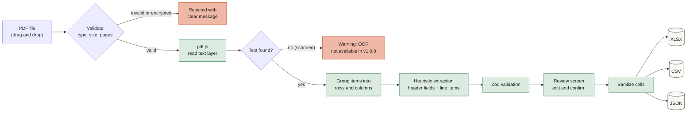
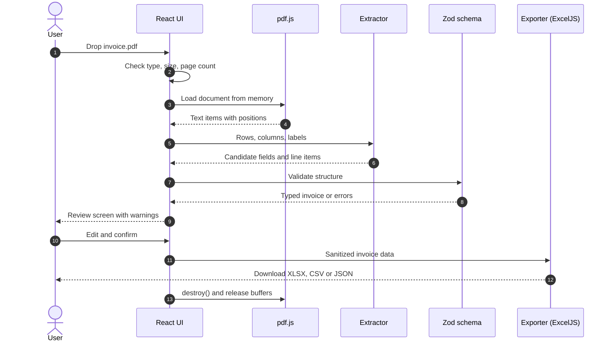
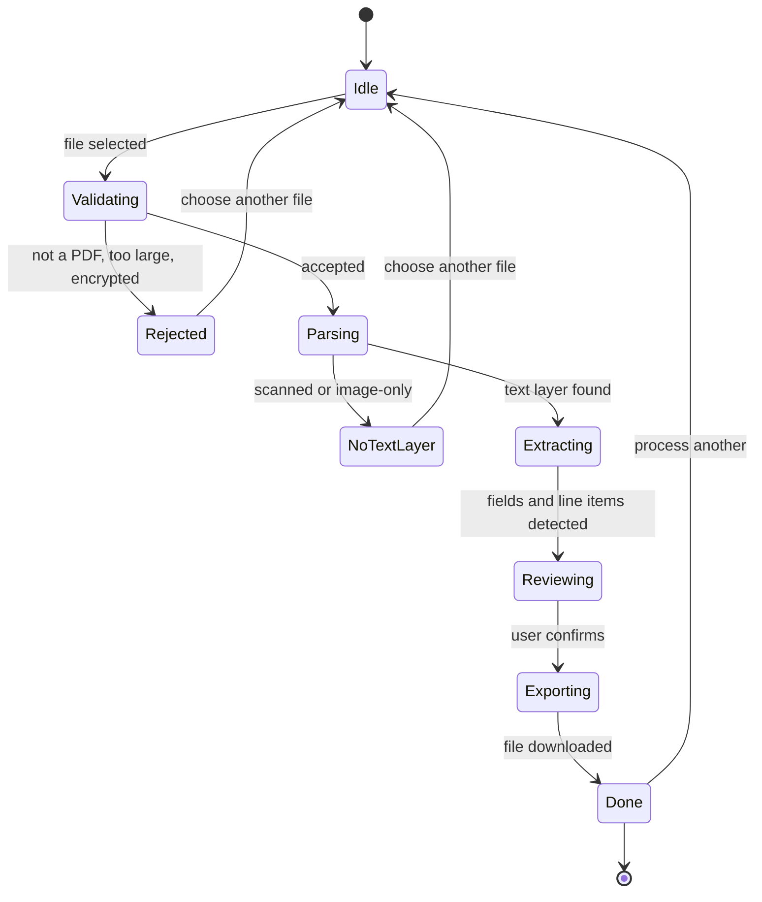
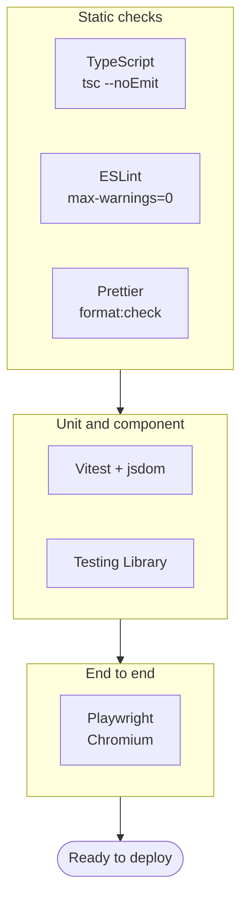
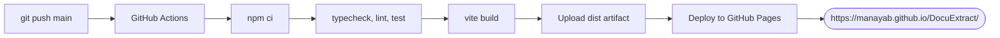
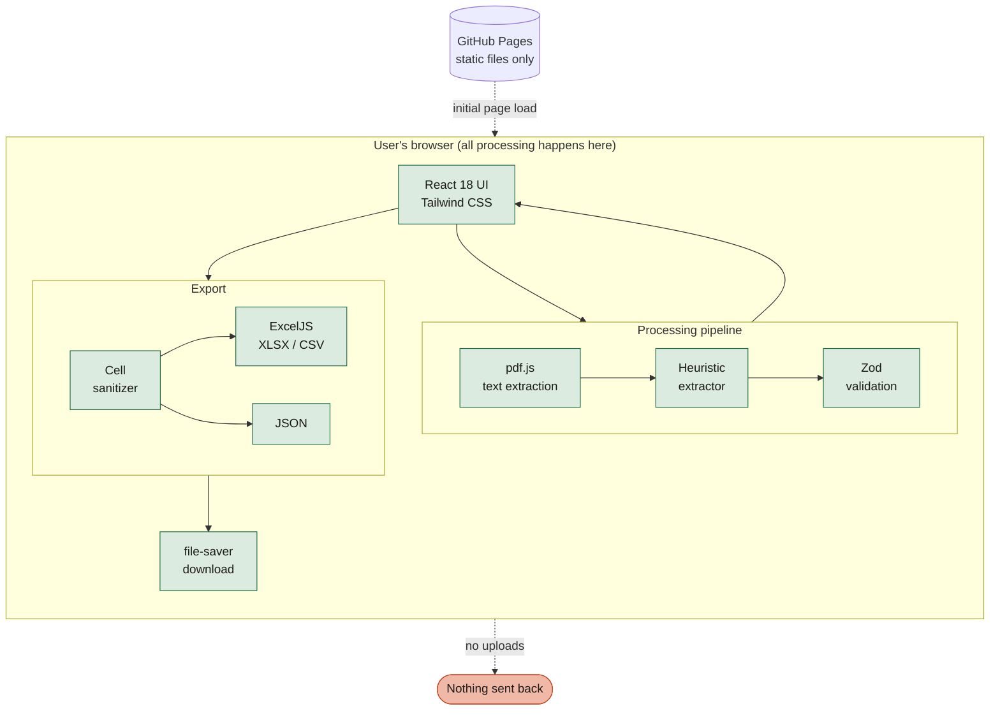
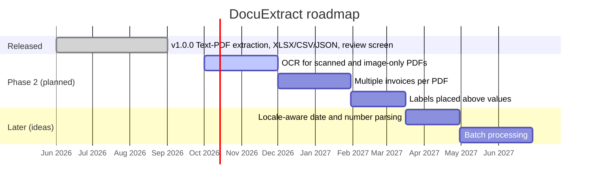

<div align="center">



# DocuExtract

**Turn invoice PDFs into clean XLSX, CSV and JSON. Entirely in your browser.**

No backend. No account. No database. No analytics. No telemetry.

[](https://github.com/MANayab/DocuExtract/actions)
[](LICENSE)
[](CHANGELOG.md)
[](package.json)
[](tsconfig.json)
[](package.json)
[](PRIVACY.md)

[**Live app**](https://manayab.github.io/DocuExtract/) &nbsp;·&nbsp; [Report a bug](https://github.com/MANayab/DocuExtract/issues) &nbsp;·&nbsp; [Request a feature](https://github.com/MANayab/DocuExtract/issues) &nbsp;·&nbsp; [Changelog](CHANGELOG.md)

</div>

---

## Table of contents

- [Why DocuExtract](#why-docuextract)
- [Features](#features)
- [How it works](#how-it-works)
- [Support matrix](#support-matrix)
- [Known limitations](#known-limitations-v100)
- [Quick start](#quick-start)
- [Scripts](#scripts)
- [Testing](#testing)
- [Deployment](#deployment)
- [Architecture](#architecture)
- [Privacy and security](#privacy-and-security)
- [Roadmap](#roadmap)
- [Tech stack](#tech-stack)
- [Contributing](#contributing)
- [License](#license)

---

## Why DocuExtract

Most invoice tools ask you to upload financial documents to a server you do not control. DocuExtract takes the opposite approach: the PDF is opened, read and converted **inside your browser tab**. The application code never sends your file anywhere, and there is nothing to sign up for.

> [!IMPORTANT]
> Extraction is **heuristic**. Always review the output before using it for accounting, tax, payment, or legal records. DocuExtract shows a review screen for exactly this reason.

## Features

| | |
|---|---|
| **Local-only processing** | PDFs are parsed in the browser with pdf.js. No upload, no server round trip. |
| **Three export formats** | XLSX (full invoice), CSV (line items), JSON (full invoice). |
| **Review before export** | Edit extracted fields and line items before you download anything. |
| **Date safety** | Ambiguous numeric dates such as `05/09/2026` are read as DD/MM/YYYY and flagged for confirmation. |
| **Safe spreadsheets** | Cells that could trigger spreadsheet formulas are sanitized on export. |
| **Validated data** | Extracted invoice data is validated with Zod before it reaches the review screen. |
| **Clean memory handling** | PDF buffers are released and PDF documents are destroyed after processing. |
| **No persistence** | Invoice data is never written to URLs, `localStorage` or `sessionStorage`. |
| **Tested** | Unit and component tests with Vitest, end-to-end tests with Playwright, type checking and linting in CI. |

## How it works



### Request lifecycle

Everything below happens on the user's device. The only network traffic is the initial load of the static site.



### Processing states



## Support matrix

| PDF type | Support |
| --- | --- |
| Text-based | **Yes.** Reliably supported. |
| Scanned PDF | **Not yet.** OCR is not implemented in v1.0.0 (planned for Phase 2). |
| Image-only | **Not yet.** OCR is not implemented in v1.0.0 (planned for Phase 2). |
| Password-protected | **Limited.** Encrypted files are rejected unless provided as an already-decrypted PDF. |
| Corrupt | No. |
| Handwritten | Not guaranteed. |
| Multi-page | **Yes**, up to 100 pages. |
| Multiple invoices per PDF | Phase 2. |

## Known limitations (v1.0.0)

- **OCR is not implemented.** Scanned or image-only PDFs show a warning and cannot be extracted. The "Enable OCR" button explains this instead of downloading anything.
- Labels and values must be on the **same line** or in **neighbouring columns of the same row**. Layouts that put a label *above* its value are not read.
- Numeric dates such as `05/09/2026` are read as **DD/MM/YYYY** and flagged for confirmation.
- Line items are detected with column gaps and the table header. Unusual tables may need manual correction on the review screen.
- One invoice per PDF.
- The CSV export contains **line items only**. Use XLSX or JSON for the full invoice.

## Quick start

**Requirements:** Node.js 20 or newer.

```bash
git clone https://github.com/MANayab/DocuExtract.git
cd DocuExtract
npm ci
npm run dev
```

Open the URL Vite prints. Because the app is built for GitHub Pages, the path includes `/DocuExtract/`.

To preview a production build:

```bash
npm run build
npm run preview
```

## Scripts

| Command | What it does |
| --- | --- |
| `npm run dev` | Start the Vite dev server with hot reload. |
| `npm run build` | Produce a production build in `dist/`. |
| `npm run preview` | Serve the production build locally. |
| `npm run typecheck` | Run `tsc --noEmit`. |
| `npm run lint` | Run ESLint with zero warnings allowed. |
| `npm run format:check` | Check formatting with Prettier. |
| `npm run test` | Run unit and component tests once (Vitest). |
| `npm run test:watch` | Run Vitest in watch mode. |
| `npm run test:e2e` | Run Playwright end-to-end tests. |

## Testing

```bash
# static checks
npm run typecheck
npm run lint
npm run format:check

# unit and component tests
npm run test

# end-to-end (first time only: install a browser)
npx playwright install chromium
npm run test:e2e
```



## Deployment

The Vite `base` path is `/DocuExtract/`. In the repository settings, set **Pages → Source** to **GitHub Actions**. Every push to `main` runs `.github/workflows/deploy.yml`, which builds the app and publishes the `dist` directory.



> [!NOTE]
> If you fork the project under a different repository name, change `base` in `vite.config.ts` to match.

## Architecture

DocuExtract is a static single-page app. There is no server component, so there is no server-side attack surface and nothing to operate.



### Design principles

1. **Local first.** If a feature would need a server, it does not ship.
2. **Never trust extracted text.** Everything read from a PDF is validated and sanitized before it is displayed or exported.
3. **Say when unsure.** Ambiguous values are flagged on the review screen instead of silently guessed.
4. **Release memory.** Documents and buffers are destroyed once processing completes.

## Privacy and security

Files are processed locally by this application and are not uploaded by application code. Verify your own browser network activity (DevTools → Network) if your environment requires independent confirmation. See [PRIVACY.md](PRIVACY.md).

| Area | Behaviour |
| --- | --- |
| Network | No upload of invoice data. No analytics or telemetry. |
| Storage | Invoice data is not written to URLs, `localStorage` or `sessionStorage`. |
| Memory | PDF buffers are released and PDF documents are destroyed after processing. |
| Spreadsheet exports | Cells that could trigger formulas are sanitized (CSV and formula injection). |
| Rendering | React rendering does not use `dangerouslySetInnerHTML`. |

To report a vulnerability, follow [SECURITY.md](SECURITY.md). Please do not open a public issue for security problems.

## Roadmap



> [!NOTE]
> Dates are indicative, not commitments. Track real progress in [Issues](https://github.com/MANayab/DocuExtract/issues).

## Tech stack

| Layer | Tools |
| --- | --- |
| UI | React 18.3, Tailwind CSS 3.4 |
| Language and build | TypeScript 5.6, Vite 5.4 |
| PDF parsing | pdfjs-dist 4.10 |
| OCR (Phase 2) | tesseract.js 5.1 |
| Validation | Zod 3.23 |
| Export | ExcelJS 4.4, file-saver 2.0 |
| Quality | ESLint 9, Prettier 3, Vitest 2, Testing Library, Playwright 1.48 |
| Hosting | GitHub Pages via GitHub Actions |

## Contributing

Contributions are welcome. Please read [CONTRIBUTING.md](CONTRIBUTING.md) and the [Code of Conduct](CODE_OF_CONDUCT.md) first.

```bash
git checkout -b feat/my-change
npm ci
npm run typecheck && npm run lint && npm run test
git commit -m "feat: describe your change"
git push origin feat/my-change
```

Then open a pull request. Sample invoices that fail to extract (with sensitive data removed) are the most useful bug reports.

## License

Released under the [MIT License](LICENSE). See also [TERMS.md](TERMS.md) and [PRIVACY.md](PRIVACY.md).

<div align="center">

Built by [@MANayab](https://github.com/MANayab)

</div>
